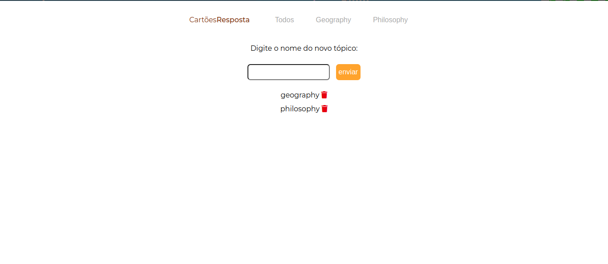

# Cartões Resposta
###### Cartões Respostas (Flash Cards) are here to get into the virtual life a simple method of memorization, optimazing the way we study.

###  [Try it](https://yasmin-carloto.github.io/Cartoes-Resposta/)


### Functions 
1. Create new flash cards
##### By using Cartões Resposta, you can create as much as flash cards you can. While you are creating, it's possible to tag it, which is going to be used later in another function.


2. Create new filters for your flash cards.
###### This function allows you to filter your cards based on the tags you put on them on their creation and on the filters you create, as shows the image below.
##### The filter "Todos" shows all of your cards.

##### Clicking on "Todos"


##### Clicking on "Geography"


3. Delete card 
##### By clicking on the trash button on the card you can delete it.

4. Edit card
##### If you just mistyped something and want to corret it, just click on the pencil in the card and edit it.


5. Delete your filter
##### You can also delete your filter just clicking on the trash that appears right next to them, once you click in the button "+ adicionar".


### Getting Started

#### Install project
```git clone https://github.com/Carloto11/Cartoes-Resposta.git```

#### Open the index.html file on your browser and you're done!

### Contribute 

1. Clone this repo
```git clone https://github.com/Carloto11/Cartoes-Resposta.git```

2. Create your branch 
```git checkout -b feature/NAME```